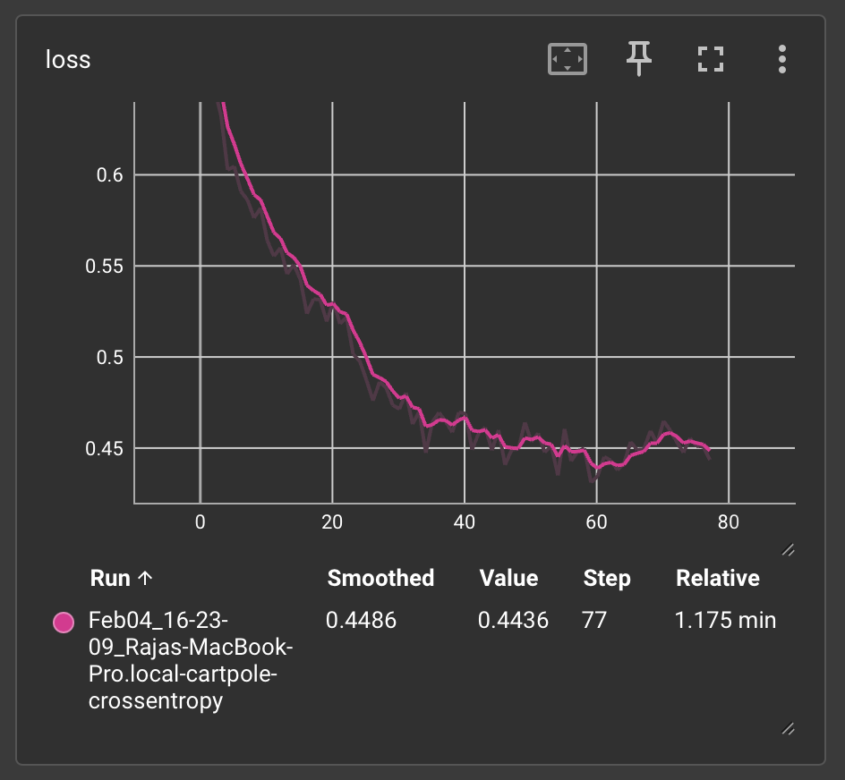
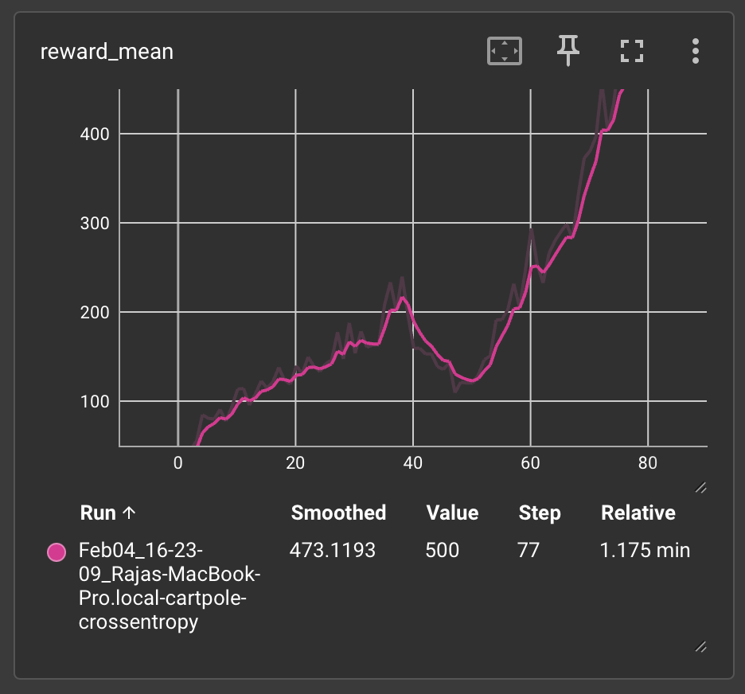

# Cartpole-RL: Solving the Cartpole Problem with Reinforcement Learning

This repository contains implementations of various **Reinforcement Learning (RL) algorithms** to solve the **CartPole-v1** environment from OpenAI Gym. The primary method used here is the **Cross-Entropy Method (CEM)**.

---

## Getting Started

### Prerequisites
Ensure you have the following installed before running the scripts:
- Python 3.x
- OpenAI Gym
- PyTorch

You can install the requirements for the repo using the following command:
```bash
pip install -r requirements.txt
```

To run the training script, 
```bash
python3 cartpole_crossentropy.py
```

To run the test script, 
```bash
python3 cartpole_crossentropy_test.py
```

The logs during training appear like the following:
```bash
Running on mps
1: loss=0.662, reward_mean=27.5
2: loss=0.646, reward_mean=44.9
3: loss=0.626, reward_mean=61.5
4: loss=0.602, reward_mean=82.3
5: loss=0.597, reward_mean=57.9
6: loss=0.573, reward_mean=79.5
7: loss=0.573, reward_mean=67.5
```

The loss and reward graphs for crossentropy model are as following:
<table>
  <tr>
    <td></td>
    <td></td>
  </tr>
</table>


